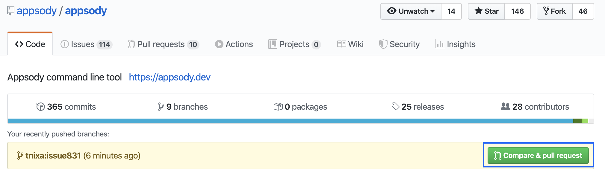
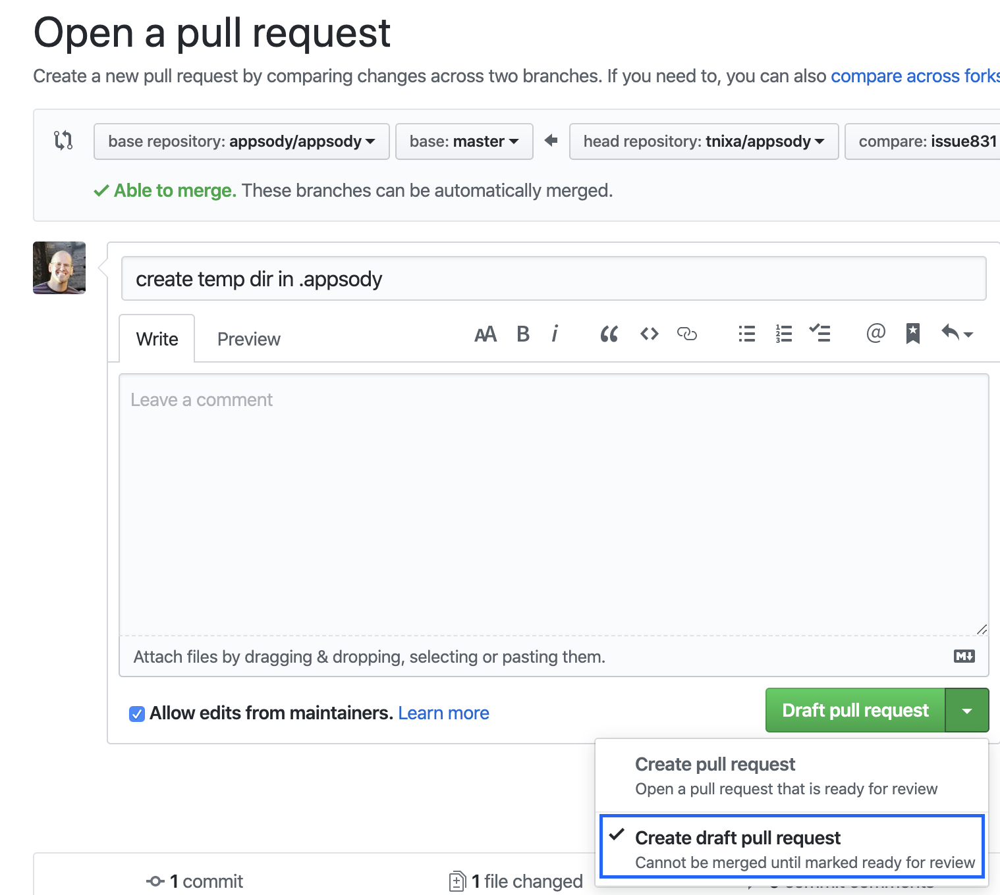

# Developer Guide
This document describes how to create a pull request for contributing to Appsody along with various ways to test code changes. 

## create pull requests:
This section describes how to create a pull request.
* create a fork for the appsody repo, ex:
    * https://github.com/appsody/appsody
        * click on the Fork button
* using git, clone your fork and create a unique branch for each issue or code task
* after committing and pushing your changes use the appsody github webpage to create a pull request
    * the github webpage for the upstream repo should show an indicator after pushing your changes, click the "Compare & pull request" button

* if you would like your code changes to be known/tracked but are not ready for them to be reviewed/approved you can create a draft pull request using the pull-down

## testing:
There are various ways to test your own code or someone else’s pull request (or branch):
* test your code changes against the test bucket
    * make test
* build the appsody binary files for the various platforms
    * an appsody binary will be created in the build directory of the repo
    * make build-darwin (mac)
    * make build-windows (windows)
    * make build-linux (linux)
* test the local appsody binary file
    * fully qualify the appsody binary file for the command you want to test, for example:
        * ./Users/tnixa/go/src/github.com/appsody/appsody/build/appsody-0.0.0-darwin-amd64 list
    * to make this easier to run from any terminal window
        * cd ~/go/bin
        * ln -s ../src/github.com/appsody/appsody/build/appsody-0.0.0-darwin-amd64 appsody-local
        * now you can call appsody-local from any terminal (assumes GOPATH/bin is on your PATH)
* test someone else's PR/branch:
    * add a remote for the user's fork, ex:
        * git remote add kylegc git@github.com:kylegc/appsody.git
    * checkout the user's branch, for example:
        * git fetch kylegc
        * git checkout kylebranch