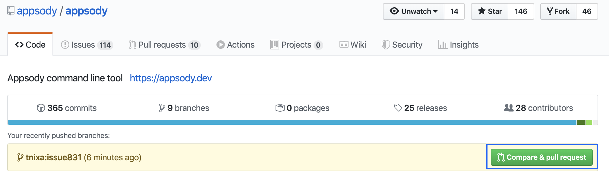
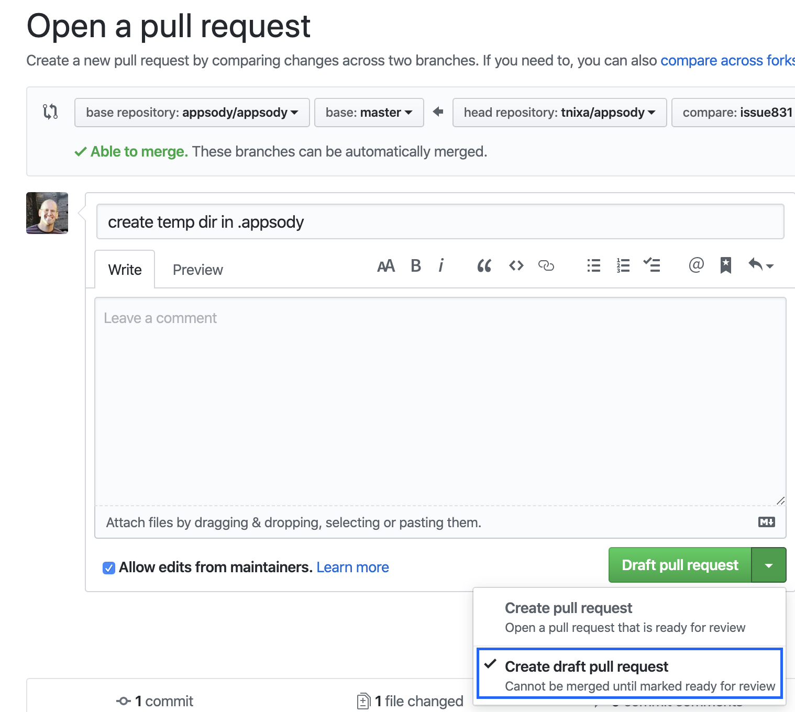

# Developer Best Practices
## go:
* mkdir -p $HOME/go/src/github.com/appsody
* brew install go (mac only)
## git:
* brew install git (mac only)
* ssh keys
    * check for existing keys
        * ls -la ~/.ssh
            * look for key pairs, ex: id_rsa, id_rsa.pub
        * if you don't have any keys you can generate new ones:
            * cd ~/
            * ssh-keygen -t rsa
                * press enter to accept the defaults
    * upload keys:
        * copy key to clipboard
            * pbcopy < ~/.ssh/id_rsa.pub
        * log into github:
            * https://github.com/settings/profile
            * On the left-hand side menu, you will see a link “SSH and GPG keys”
                * click "New SSH Key" button
                * give it a name
                * paste in the copied key from clipboard
                * click "Add SSH Key" button
## fork setup
* create a fork for the appsody repo, ex:
    * https://github.com/appsody/appsody
        * click on the Fork button
* clone your fork, ex:
    * cd $HOME/go/src/github.com/appsody
    * git clone git@github.com:tnixa/appsody.git
* go into the repo
    * cd appsody
* verify you only have origin remote
    * git remote -v
* rename origin to your userid, ex:
    * git remote rename origin tnixa
 * add a remote for your fork, ex:
    * git remote add upstream git@github.com:appsody/appsody.git
* set master to point to upstream
    * git branch master -u upstream/master
## branch setup (every time you work on a new issue/PR)
* checkout and update master
    * git checkout master
    * git pull master
* create a branch, ex:
    * git checkout -b testbranch
* set tracking of branch
    * make changes to the files you want
* stage the changes
    * git add .
* commit the changes
    * git commit -m "commit message"
* push the changes and set tracking of the branch
    * git push -u tnixa testbranch
    * verify the tracking 
        * git branch -avv
## create pull requests:
* the github webpage for the upstream repo should show an indicator after pushing your changes, click the "Compare & pull request" button

* if you would like your code changes to be known/tracked but are not ready for them to be reviewed/approved you can create a draft pull request using the pull-down

## sync changes from upstream to fork master branch
* git checkout master
* git pull master
* git checkout <branch>
* git merge master (some people prefer rebase here, but that should only be used if you haven't created a PR yet)
## testing:
* test your code changes against the test bucket
    * make test
* build the appsody binary files for the various platforms
    * make build-darwin (mac)
    * make build-windows (windows)
    * make build-linux (linux)
        * this creates an apposdy binary in the build dir of the repo
* test appsody binary file
    * fully qualify the appsody binary file for the command you want to test, ex:
        * ./Users/tnixa/go/src/github.com/appsody/appsody/build/appsody-0.0.0-darwin-amd64 list
    * to make this easier to run from any terminal window
        * cd ~/go/bin
        * ln -s ../src/github.com/appsody/appsody/build/appsody-0.0.0-darwin-amd64 appsody-local
        * now you can call appsody-local from any terminal (assumes GOPATH/bin is on your PATH)
* test someone's PR/branch:
    * add a remote for the user's fork, ex:
        * git remote add kylegc git@github.com:kylegc/appsody.git
    * checkout the user's branch, ex:
        * git fetch kylegc
        * git checkout kylebranch